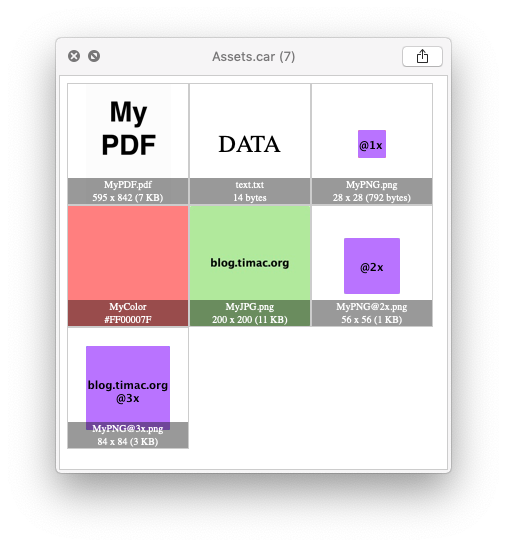

# QLCARFiles
QuickLook plugin to visualize .car files (compiled Asset Catalogs)

# Blog post
[https://blog.timac.org/2018/1112-quicklook-plugin-to-visualize-car-files/](https://blog.timac.org/2018/1112-quicklook-plugin-to-visualize-car-files/)

# Description
The `QLCARFiles` QuickLook plugin lets you visualize the content of a car file. It extracts the assets using the CoreUI.framework, generates a webpage with all the images, and displays this webpage in the QuickLook window. The use of a webpage has several advantages, one of them being the possibility to render multiple images in a scrolling view.

## Features

- Display images and their dimensions and file sizes
- Support for png, pdf, gif, svg, video, ...
- Display named colors and their hex values
- Support for Light and Dark mode
- Generate the previews as HTML data to allow scrolling
- Display the total number of assets in the window's title
- Add a light gray background to images that are too white or transparent
- For thumbnails, render the best asset as icon and the number of assets
- The command line tool has a `-r` option to dump all the car files found in a folder

## Known limitations

- No support for special car files used by pro applications like Final Cut Pro.
- Assets of the following type are not supported: CUINamedExternalLink, CUINamedTexture, CUINamedModel, CUINamedRecognitionImage, CUINamedRecognitionGroup, CUINamedRecognitionObject, CUINamedVectorImage, CUINamedMultisizeImage, CUINamedLayerImage. So far I never encountered these types of renditions.

